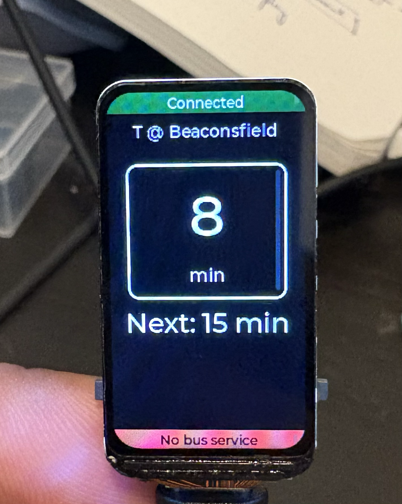
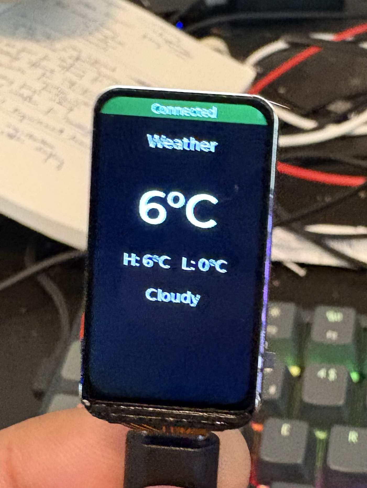
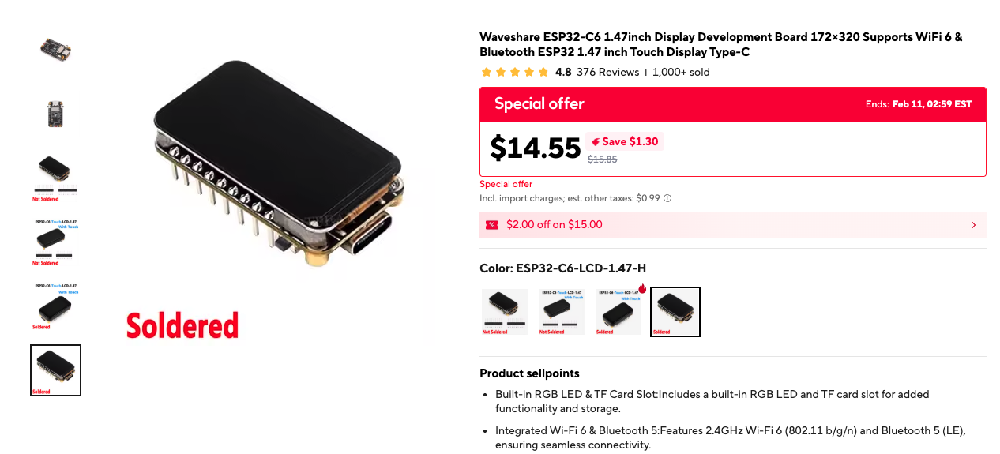

# MBTA LCD Tracker




I wanted to see the T timings in Boston before leaving home but it was sorta hard to open my phone in a hurry. This project is a dedicated display that stays on my desk and shows me exactly when the next bus or train is coming.

### How it works

The code runs on an ESP32-C6 and uses LVGL to render the UI. It connects to Wi-Fi and fetches:

- Real-time MBTA predictions using the MBTA V3 API.
- Current weather and forecasts from Open-Meteo.

It cycles between an MBTA prediction screen and a weather screen. If there are no upcoming buses or trains, it shows a banner letting you know.

### Hardware

I used the ESP32-C6-LCD-1.47 development board.
I got it from [AliExpress](https://www.aliexpress.us/item/3256808021195018.html)



The starter repository I got from Spotpear had a demo repo but I could not get it working at all, so I modified it to work with the latest ESP-IDF version.

### Setup

If you have the same board and want to run this:

1. **Install ESP-IDF**: Make sure you have the ESP-IDF environment set up.
2. **Clone the repo**:

   ```bash
   git clone https://github.com/neutralboy/mbta-display.git
   cd mbta-display
   ```

3. **Configure**:
   Copy the example config:

   ```bash
   cp main/config.h.example main/config.h
   ```

   Edit `main/config.h` with your Wi-Fi credentials and the MBTA Stop IDs you want to track.
4. **Build and Flash**:
   Set the target to ESP32-C6:

   ```bash
   idf.py set-target esp32c6
   ```

   Build, flash, and monitor:

   ```bash
   idf.py build flash monitor
   ```

### Configuration

The project is configured via `main/config.h`. Here are the available options:

| Name | Data Type | Description | Default Value |
| :--- | :--- | :--- | :--- |
| `WIFI_SSID` | `string` | Wi-Fi network name | `"YOUR_SSID"` |
| `WIFI_PASS` | `string` | Wi-Fi network password | `"YOUR_PASSWORD"` |
| `MBTA_FETCH_PERIOD_MS` | `integer` | MBTA data fetch interval in milliseconds | `30000` |
| `MBTA_BRIGHTNESS_PCT` | `integer` | Display brightness percentage (0-100) | `30` |
| `MBTA_SHOW_START_HOUR` | `integer` | Hour to start showing display (24h format) | `6` |
| `MBTA_SHOW_END_HOUR` | `integer` | Hour to turn off display (24h format) | `15` |
| `WEATHER_LATITUDE` | `float` | Latitude for weather data | `42.342110` |
| `WEATHER_LONGITUDE` | `float` | Longitude for weather data | `-71.145805` |
| `WEATHER_FETCH_PERIOD_MS` | `integer` | Weather data fetch interval (default 10 mins) | `600000` |
| `DEFAULT_TIMEZONE` | `string` | POSIX timezone string for local time | `"EST5EDT,M3.2.0,M11.1.0"` |
| `MBTA_STOP_1_ID` | `string` | MBTA Stop ID for the first screen | `"1295"` |
| `MBTA_STOP_1_NAME` | `string` | Human-readable name for stop 1 | `"Bus 65 to Kenmore"` |
| `MBTA_STOP_2_ID` | `string` | MBTA Stop ID for the second screen | `"70176"` |
| `MBTA_STOP_2_NAME` | `string` | Human-readable name for stop 2 | `"T @ Beaconsfield"` |
